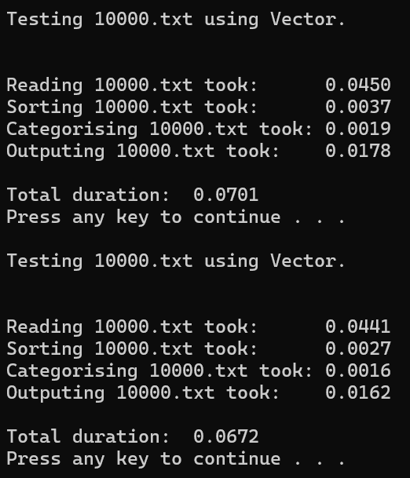
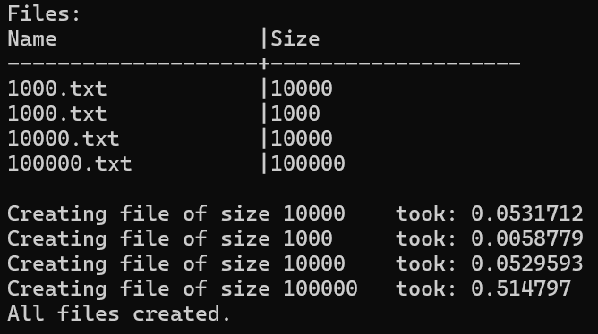
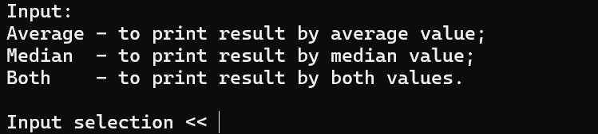

# Description
The **Students** application is designed to help work with students' data. Mainly for writing and
 reading 
data and quickly finding students' final results. Also, it is equipped with functions for 
programs' various speed measurements. 

## How to use the program
After running the program you will see the list of commands. Commands can be categorized into 
three categories:
* working with data;
* testing programs;
* other additional commands.

## Working with data

* `Open` - After running the command, the user is asked to make 
[these](#printing-and-sorting-key-selection) selections. The user will be provided with a
 similar table:   
   
Then user just needs to enter the ID of the files it wants to open.

* **Integer input** - After running the command, the user is asked to make 
[these](#printing-and-sorting-key-selection) selections. The integer 
he enters is the number of students, which data will have to be entered manually by the user.
 Every student's name and
 surname will have to be entered manually. Then there will be a couple of choices:
	- Enter the exam result and then the homework marks, and in the end press ENTER twice.
	- Or enter `Auto` to generate exam results and a random number of homework marks.
	
## Testing the program

Here are the commands for measuring program efficiency, meant for optimizing the program.

* `Test` - This is the main command for testing the program's speed. After running the command,
 the user is asked to make [these](#printing-and-sorting-key-selection) selections. Then the user 
 is provided with the same table of available **.txt** files. Then user needs to enter the IDs of
  files to be tested, also user can enter the same ID a few times and later get average value
   durations from all tests with that file.     
   

* `Create` - This command is for creating test data. Users can create multiple files by writing 
the file name and size for each data file they want to create.      
 

* `Change`- This command lets the user change the container type (either **vector** or **list**) 
that will be used for storing students' data during processing.

* `Strategy` - This command lets the user choose one of 3 available strategies for categorizing 
students by their final result. Here are the strategies.

* `Results` - This command prints tables in markdown format of testing data that was gathered 
since the start of running the program.

## Additional commands

* `Info` - This command lists all commands for working with the program.

* `Show` - This command creates the table of available .txt files in the local directory.

* `Check` - Prints currently used container type for storing data and strategy number for 
categorising students.

* `End` - For closing programs work.

## Printing and sorting key selection
For printing results to file, the user can choose one out of three options.

1. `Average` - to print the final result calculated using the average value of homework marks.
2. `Median` - to print the final result calculated using the median value of homework marks.
3. `Both` - to print both **1.** and **2.** options.    

 

For sorting data user can choose up to two keys from four available:
* Name
* Surname
* Average
* Median
     
 

# Installation

Here are the steps to install and run the program:

1. Download the latest release **v3.0** by going to releases, then release **v3.0** and press on **Source code (zip)**.
2. **Unzip** the file **Students_final-3.0.zip**.
3. Run the **Setup.msi** file.
4. Then few times you'll need to press **next**.
5. Then window asking **administrator permssion** will apear on the screen. Press **YES**.
6. Finnaly you can just close Setup window.
7. Run the **Students** application from start up menu or using desktop shortcut.
8. Follow the instructions on the screen or read [instructions](#how-to-use-the-program) on 
how to use the program.

To unistall the program:
1. Start `Setup.msi` file.
2. Select **Remove setup**.
3. Press **finish** and click **YES** on the window that pops-up.
4. Finnaly, just close **Setup** window.

#

You can find technical details abou the program [here](https://github.com/Cristup/Students_new).